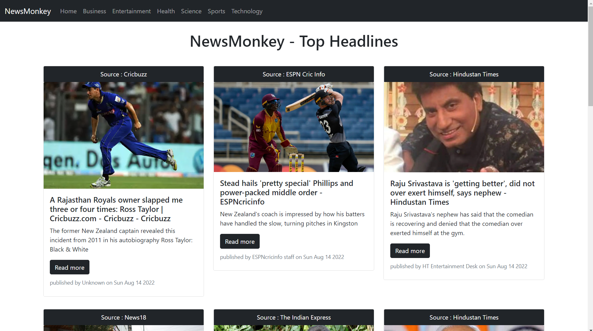

 
  

  <!-- <a href="https://e_commerce_app_flutter.netlify.app">Demo</a> -->

<h1 align="center">News Monkey</h1>

## Status

<h4 align="center">
News Monkey Completed
</h4>

  <a href="#dart-about">About</a> &#xa0; | &#xa0; 
  <a href="#checkered_flag-illustrations">Illustrations</a> &#xa0; | &#xa0;
  <a href="https://github.com/MusheerJ" target="_blank">Author</a>

 

## :dart: About

Build a Web site that provides daily news on different category like Business, Entertainment, Sports, Technology, etc 

## :sparkles: Tech Used
:heavy_check_mark: React\
:heavy_check_mark: BootStrap\
:heavy_check_mark: NewsApi

## :checkered_flag: Illustrations

Here are some Illustration of App Screens

|  | 
| :--------------------------------: | 
|            Home Screen             | 

|  | 
| :--------------------------------: | 
|            Business             | 

|  | 
| :--------------------------------: | 
|            Tab View            | 

|  | 
| :--------------------------------: | 
|            Mobile View             | 

